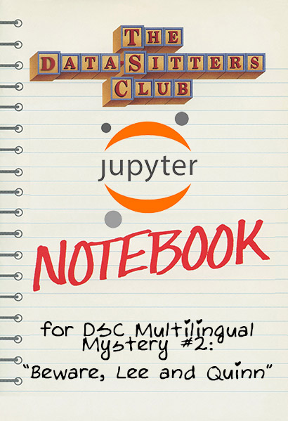

# DSC Multilingual Mystery 2: Beware, Lee and Quinn!

This repo has the [Jupyter notebook with the first part of this DSC book](dscm2.ipynb), along with all the code used in the book.

You can read the full text of the book [on the Data-Sitters Club site](http://datasittersclub.github.io/site/dscm2).
